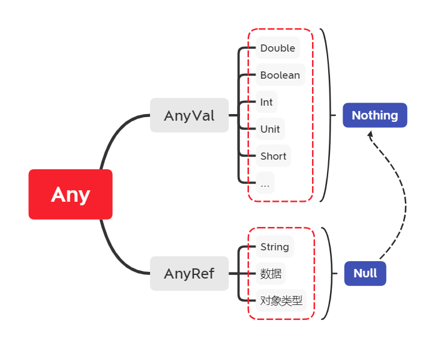

# 1.Scala简介
## 1.1 概述
Scala来源于“Scalable Language（可伸缩的语言）”，它是基于JVM的多范式编程语言，或者说，**Scala是一种运行在JVM上的函数式的面向对象语言**。
## 1.2 语言特点
- 兼容的
- 精简的
- 高级的
- 静态类型的
- 可以开发大数据应用程序（Spark、Flink）
# 2.Scala执行流程
Scala源码->scalac编译器->Java类库/Java字节码/scala类库->JVM->操作系统
# 3.Scala环境搭建
## 3.1 概述
Scala程序依赖于Java类库，必须有Java运行环境：
- JDK
- Scala编译器（Scala SDK）
## 3.2 安装JDK（1.8 64位）
## 3.3 安装Scala SDK（2.11.12）
步骤：  
1. 官网下载对应版本的msi文件并安装
2. cmd输入`scala -version`检测是否安装成功
## 3.4 安装IDEA scala插件
IDEA默认不支持scala开发  
步骤：  
### 3.4.1 下载指定版本的IDEA scala插件
1. 插件要和安装的IDEA版本一致
2. 官方下载地址：[(http://plugins.jetbrains.com/plugin/1347-scala)]
3. 插件安装：初始界面右下角Configure->Plugins->上方设置->Install plugin From Disk
# 4.Scala解释器
`println("Hello World~")`  
退出解释器：  
`:quit`
# 5.Scala基本语法
## 5.1 输出语句和分号
### 5.1.1 输出语句
方式一：换行输出  
`println(值1，值2，...);`  
方式二：不换行输出  
`print(值1，值2，...);`
### 5.1.2 分号
- 单行代码最后的分号可写可不写
- 多行代码在一行，写分号
- 最后一行代码分号可写可不写
## 5.2 常量
- 字面值常量
    - 整型（Int）
    - 浮点型
    - 字符串（String，"abc"）
    - 字符（'a'）
    - 布尔（false, true）
    - 空（null）
- 自定义常量
## 5.3 变量
Java定义：  
`int a=0;`  
Scala定义：   
`val/var 变量名:变量类型=初始值`  
- val:自定义常量 
- var:变量    

使用类型推断定义变量：  
`val name="Tom"`  
## 5.4 字符串
### 5.4.1 双引号定义
`val/var 变量名="字符串"`  
### 5.4.2 插值表达式定义
`val/var 变量名=s"${变量/表达式}字符串"`
### 5.4.3 三引号定义（多行）
`val/var 变量名="""字符串1 字符串2"""`
## 5.5 惰性赋值
`lazy val/var 变量名=表达式`  
只有用到该变量时，该变量才会加载到内存中
## 5.6 标识符（类似于Java）
### 5.6.1 命名规则
- 大小写英文字母/数字/下划线/$
- 数字不能开头
- 不能和关键字重名
### 5.6.2 命名规范
- 变量或方法：小驼峰（第二个单词开始首字母大写）
- 类或特质（Trait）：大驼峰（每个单词首字母大写）
- 包：全部小写，一般是域名反写，多级包.分开
## 5.7 数据类型
基础类型|类型说明
---|:--:
Byte|8位带符号整数
Short|16位带符号整数
Int|32位带符号整数（默认）
Long|64位带符号整数
Char|16位无符号Unicode字符
String|Char类型的序列（字符串）
Float|32位单经度浮点数
Double|64位双精度浮点数（默认）
Boolean|true或false
继承关系：  

## 5.8 类型转换
### 5.8.1 自动类型转换
范围小的类型值自动转换为范围大的类型值  
从小到大：Byte，Short，Char->Int->Long->Float->Double。
### 5.8.2 强制类型转换
注意：可能会造成精度缺失  
格式：`val/var 变量名:数据类型=具体的值.toXxx`  
### 5.8.3 值类型和String类型的相互转换
- 值类型->String类型
    - `val/var 变量名:String=值类型数据+""`
    - `val/var 变量名:String=值类型数据.toString()`

- String类型->值类型  
`val/var 变量名:值类型=字符串值.toXxx()`  
## 5.9 键盘录入
```
import scala.io.Stdin
Stdin.readLine()
Stdin.readInt()
```
# 6.运算符
## 6.1 算数运算符
+-*/%  
注意：没有++，--运算符
## 6.2 赋值运算符
- 基本赋值运算符：*=*
- 扩展赋值运算符：*+=，-=，\*=，/=*
## 6.3 关系运算符
\>，<，>=，<=，==，!=  
- 比较数据：==或!=
- 比较地址：eq方法  
## 6.4 逻辑运算符
&& || ! 与或非
## 6.5 位运算符
按位与：&  
按位或：|  
按位异或：^  
按位取反：~  
按位左移：<<  
按位右移：>>  
# 7.流程控制
## 7.1 顺序结构
从上到下，从左到右。
## 7.2 选择结构
- 单分支：
```
if(关系表达式) {
    //对应的代码
}
```
- 双分支：
```
if(关系表达式) {
    //对应的代码
}else{
    //对应的代码
}
```
- 多分支：
```
if(关系表达式1) {
    //对应的代码
}else if(关系表达式2){
    //对应的代码
}else{
    //对应的代码
}
```
- 块表达式 {} 块表达式的值就是最后一个表达式的值
## 7.3 循环结构
- for循环
```
for (i <- 表达式/数组/集合) {
    //代码
}
```
守卫：for表达式中添加if条件
```
for (i <- 表达式/数组/集合 if 表达式) {
    //代码
}
```
推导式：for循环中使用yeild表达式构建一个集合  
参考代码：  
`for (i <- 1 to 10) yield i * 10`
- while循环
```
初始化条件
while(判断条件) {
    //循环体
    //控制条件
}
```
- do while循环
```
初始化条件
do{
    //循环体
    //控制条件
}while(判断条件) 
```
- break/continue  
scala中移除了这两个关键字，替代的方法：  
```
1.import scala.util.control.Breaks._
2.使用breakable将for表达式包裹起来
3.for循环中需要退出的地方添加break()方法
continue:
使用breakable将for循环体包含起来
```
# 8.方法和函数
## 8.1 方法
格式：  
```
def 方法名(参数名：参数类型，参数名：参数类型)：[return type]= {
    //方法体
}
```
返回值可以有类型推断  
（递归方法不可省略返回类型）
### 8.1.1 惰性方法  
方法的返回值变量被声明为lazy时，方法的执行被推迟，直到首次使用值时方法才会执行。  
使用场景：
- 1.打开数据库连接
- 2.提升某些特定模块的启动时间
- 3.确保对象中某些字段能优先初始化
### 8.1.2 方法参数
- 默认参数（参数类型=10）
- 带名参数（a=1）
- 变长参数
```
def 方法名(参数名：参数类型*)：[return type]= {
    //方法体
}
```
### 8.1.3 方法调用方式
- 后缀调用法 `对象名.方法名(参数)`
- 中缀调用法  `对象名 方法名 参数`
- 花括号调用法（一个参数） `对象名.方法名{参数}`
- 无括号调用法  无参数和返回值  `方法名`
*操作符即方法*
## 8.2 函数
### 8.2.1 定义
`val 函数变量名=(参数名:参数类型, 参数名:参数类型..) => 函数体`  
注意：
- Scala中，函数是一个对象
- 类似于方法，函数也有参数列表和返回值
- 函数定义不需要def
- 无需指定返回值类型
## 8.3 方法vs函数
- 方法属于类或对象，加载到JVM的方法区
- 函数是对象，加载到JVM堆内存
- 函数继承自FunctionN
# 9.类和对象
Scala：函数式-面向对象语言
## 9.1 创建类和对象
跟java类似，new  
简写方式：  
- 如果类是空的，可以省略{}
- 如果构造器参数为空，可以省略{}
## 9.2 定义和访问成员变量
- var/val修饰
- 通过.访问成员变量
## 9.3 定义和访问成员变量
- var类型成员变量：
    - String => null
    - Int => 0
    - Boolean => false
    - Double => 0.0
    - ...
- val 类型的成员变量必须手动初始化
## 9.4 定义和访问成员方法
```
def 方法名(参数名：参数类型*)：[return type]= {
    //方法体
}
```
## 9.5 权限修饰符
private/private[this]/protected 没有public，默认public
## 9.6 类的构造器
### 9.6.1 主构造器
```
class 类名(var/val 参数名:类型=默认值,..) {
    //构造代码块
}
```
### 9.6.2 辅助构造器
```
def this(参数名:类型,...) {
    //先调用主构造器或者其他构造器
    //构造器代码
}
```
## 9.7 单例对象
`object 单例对象名()`  
调用：类名.a 类名.a()
## 9.8 定义程序主入口
scala必须有一个程序入口main()方法，且必须在单例对象中
### 9.8.1 定义main方法
```
def main(args:Array[String]):Unit = {
    //方法体
}
```
### 9.8.2 继承App特质
```
object 单例对象名 extends App {
    //方法体
}
```
## 9.9 伴生对象
一个class和一个object具有同样的名字，这个object称为**伴生对象**，这个class称为**伴生类**。  
private[this]权限，伴生对象不能访问。
## 9.10 apply方法
创建对象可以不使用new  
```
object 伴生对象名 {
    def apply(参数名:参数类型,...) = new 类(...)
}
val 对象名=伴生对象名(参数1,参数2,...)
```
# 10.继承与抽象类
## 10.1 继承
语法：**extends**
```
class/object A类 extends B类 {
    ..
}
```
## 10.2 方法重写
子类可以用override重写父类成员，super引用父类成员
## 10.3 类型推断
- 粗糙判断：IsinstanceOf判断类型/asInstanceOf转换类型
- 准确判断：gerClass/classOf
## 10.4 抽象类 abstract
- 抽象字段：没有初始化值的变量  
- 抽象方法：没有方法体的方法  
格式：
```
abstract class 抽象类名 {
    //抽象字段
    val/var 抽象字段名:类型
    // 抽象方法
    def 方法名(参数:参数类型, ...):返回类型
}
```
## 10.5 匿名内部类
继承了类的匿名的子类对象  
```
new 类名() {
    //重写所有抽象内容
}
```
# 11.特质（类似于接口）
## 11.1 简介
- 瘦接口：特质中只有抽象内容
- 富接口：特质中既有抽象内容也有具体内容
定义特质：
```
trait 特质名称 {
    //普通字段
    //抽象字段

    //普通方法
    //抽象方法
}
```
继承特质：
```
class 类 extends 特质1 with 特质2 {
    //重写抽象字段
    //重写抽象方法
}
```
## 11.2 对象混入trait
定义：不改变类本身的性质，仅仅针对对象扩展功能  
语法：`val/var 对象名=new 类 with 特质`  


